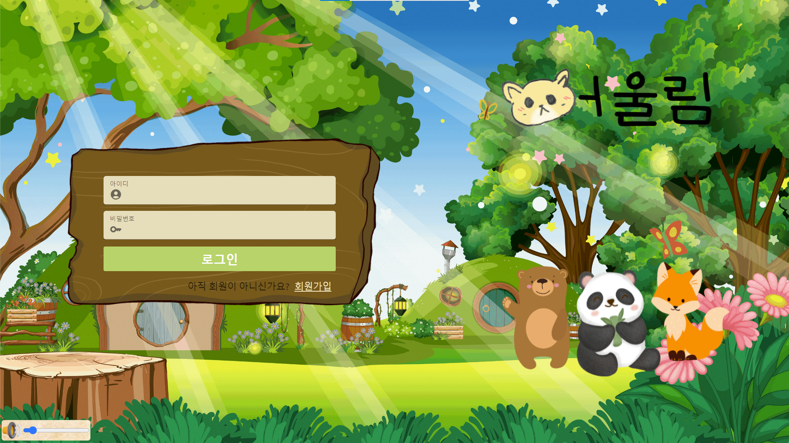
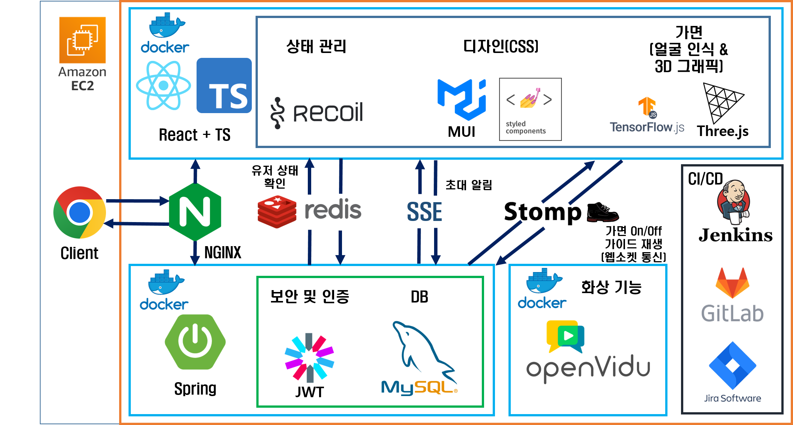
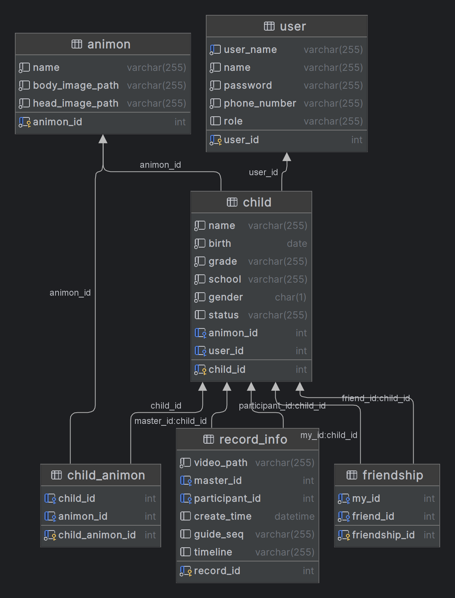

# 

교외 지역 아이들이 또래 친구를 사귈 수 있는 1:1 랜덤 화상 미팅 서비스

 

## 💡 **서비스 소개**

-   교육통계에 따르면 2023년 신입생이 1명인 곳이 125개교, 3명 이하인 학교가 500여개교 입니다.
-   동네에 또래 친구가 적은 교외 지역 초등학교 1~3학년 아이들을 위한 1:1 랜덤 화상 미팅 기능을 제공합니다.
-   초등학교 선생님들과 학생들을 대상으로 두 번의 설문조사를 진행하여 서비스의 기능을 구체화 했습니다.
-   핵심 기능
    - 1:1 랜덤 화상 미팅 기능
    - 아이들의 대화를 유도하는 가이드 기능
    - 아이들의 흥미를 끄는 동물 가면 기능
    - 만났던 친구를 다시 만날 수 있는 초대 기능
    - 부모님의 걱정을 덜어주는 녹화 기능

 

## 📅 **프로젝트 진행 기간**

**2023/07/10(월) ~ 2023/08/18(금)  **
SSAFY 9기 2학기 공통프로젝트 최우수상 🏆

 

## 🎬 **어울림 시연 영상**

 

## 💻 **서비스 화면**

### **회원가입, 로그인, 프로필**

**회원가입**

 

**로그인 및 프로필 생성**

 

<!-- 

**프로필 수정** -->

 

### **새 친구 만나기**

<!-- 

**메인 튜토리얼** -->

<!--   -->

**프로필 애니몬 변경**

 

**랜덤 화상 미팅 시작**

 

**가면 및 가이드 기능**

 

<!-- 

**종료 기능** -->

<!--   -->

### **내 친구 만나기**

**내 친구 리스트**

 

<!-- 

**친구 초대 받기 기능** -->

 

**친구에게 초대 보내기**

 

### **녹화 기능**

**녹화 기능**

 

## 🏗️ **아키텍처**

 

## 🗃️ **ERD**

 

## 👥 **팀원 역할**

### **Frontend**

-   김성준 - Web Design Manager
    -   웹 디자인 총괄-styled-components, MUI
    -   웹 프레임 설계-TypeScript, React, Recoil
        -   회원가입, 로그인, 프로필, 메인, 녹화, 내 친구, 웹페이지 기능 및 배경음악 기능
    -   기획 및 최종발표 자료 제작-PPT
    -   프로토타입 설계

-   안경준 - Project Leader
    -   AR 마스크 기능 구현-Three.js, tf.js
    -   영상 타임라인 기능 구현-react-player
    -   초대 기능 구현-SSE
    -   웹소켓 연결-Stomp.js
    -   문서화

-   오영재 - Front Leader
    -   웹 컴포넌트 관리-styled-components, MUI, React, TypeScript, React-Router, Recoil
    -   새 친구, 내 친구 페이지-openvidu-browser
    -   WebRTC, useOpenVidu, useStream Custom Hooks
    -   Frontend 코드 리뷰

### **Backend**

-   고우민 - Backend Leader
    -   Spring Security를 이용한 JWT 인증/인가 구현
    -   Redis를 이용한 실시간 접속 상태 확인 기능 구현
    -   SSE를 이용한 실시간 초대 알림 기능 구현
    -   데이터베이스 ERD 설계, JPA Entity 매핑

-   김하영 - Infra Manager
    -   DB 서버, 백엔드 개발 서버, 배포 서버 구축
    -   Docker 컨테이너 관리
    -   CI/CD 자동 배포 구축-Jenkins
    -   새 친구 만나기, 내 친구 만나기, 녹화 영상 API 개발

-   유연석 - Project Manager
    -   Jira, Git, 버전 관리
    -   Spring Boot Backend API, Spring Data JPA, WebSocket
    -   DB 스키마 설계, MySQL RDBMS 관리
    -   유저, 프로필, 친구 API 개발
 

## 🛠️ **기술 스택**

### **Front**

 
 
 
 
 
 

 
 
 

 

### **Back**

 

 

 

 

### **CICD**

 

 

### **기타**

### **협업 툴**

 

<!-- ## 📚 **프로젝트 산출물** -->

<!-- -   [기능 명세서](https://docs.google.com/spreadsheets/d/1LJWp10l55WSav7c_ZgmGGtJ5U0w4zq0SYePQb5vVUXo/edit?usp=sharing) -->

<!-- -   [와이어프레임](https://www.figma.com/file/kg0ofaik0sI6lImrCvkDXe/PJT?type=design&node-id=0-1&mode=design&t=1uZ910Wow6FieKb0-0)
-   [덤프데이터](./exec/Dump20230817.sql)
-   [포팅 메뉴얼](./exec/포팅메뉴얼.md) -->
<!-- -   [발표자료](./exec/최종 발표/최종 발표 제출용.pdf) -->

<!--   -->

## ✔ **Git 커밋 메시지 컨벤션**

-   `Feat` : 기능 추가, 프로젝트 생성, 초기 설정
-   `Fix` : 기능 변경, 기능 수정, 오류 수정
-   `Refactor` : 같은 기능을 하는 코드를 리팩토링(재작성)한 경우 (Logic 변경 X)
-   커밋 타입은 **대문자**로 시작하며, 항상 대괄호 안에 파트를 입력하여 시작
-   관련된 지라 이슈 번호에 괄호를 붙여 뒤에 추가.

ex) **BE-FEAT : {간단한 설명}(#{issue number or jira issue})**

 

## ✔ **Git 브랜치 컨벤션**

-   `master`
    -   배포 가능한 상태의 결과물 올리는 브랜치
-   `develop`
    -   구현 완료된 기능을 병합하기 위한 브랜치
-   `dev-back`
    -   backend의 메인 개발 브랜치
-   `dev-front`
    -   frontend의 메인 개발 브랜치
-   `feature`
    -   개별 기능 구현 브랜치
-   **feature 브랜치가 완성되면 dev-back, dev-front 브랜치로 merge request를 통해 merge한다.** 
    ⇒ merge request가 요청되면 leader가 코드 리뷰 이후에 merge한다.

 
